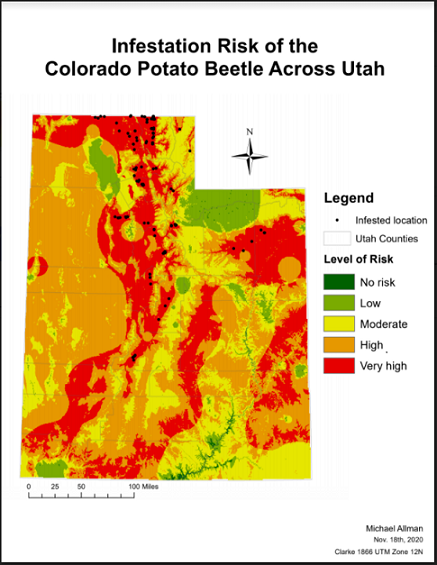

# Portfolio

---
## Projects

### [Howard County Race and Income Distribution](/Lab_8_GES_486/index)
A web map displaying a bivariate map comparing the median household income and the population percentage of non-Hispanic Black people for Howard County tracts. Click on the title for more information or the image to go straight to the web map.

---
### [Baltimore City Poverty and Rent Change](/GES486_Lab6/index)
A bivariate map comparing the percent change of median gross rent and the population below the poverty line of Baltimore City tracts.

---
### [Maryland Forest Loss](/project1_486/index)
A representation of forest loss across Maryland from 2001 to 2018.

---
### [Diamond Head Crater](/Diamond_Head_Crater/index)
An elevation model of Honolulu's most famous crater.

---
### [Maryland Housing Units](/project_probation/index)
A change through time of Maryland housing units.

---
### [poop](/UMBC_Freshmen_Sources/index)
A depiction of where UMBC's 2012 freshmen came from.

---
### Additional Projects

- [Ports of the World (webmap)](/Lab_5/Ports_Webmap/index)
- [Esri Storymap of Frederick City Flooding](https://arcg.is/14L1rD0)
- [Colorado Potato Beetle Risk in Utah]()
- [Sources of UMBC Freshmen](<img src="project_probation/)

---
